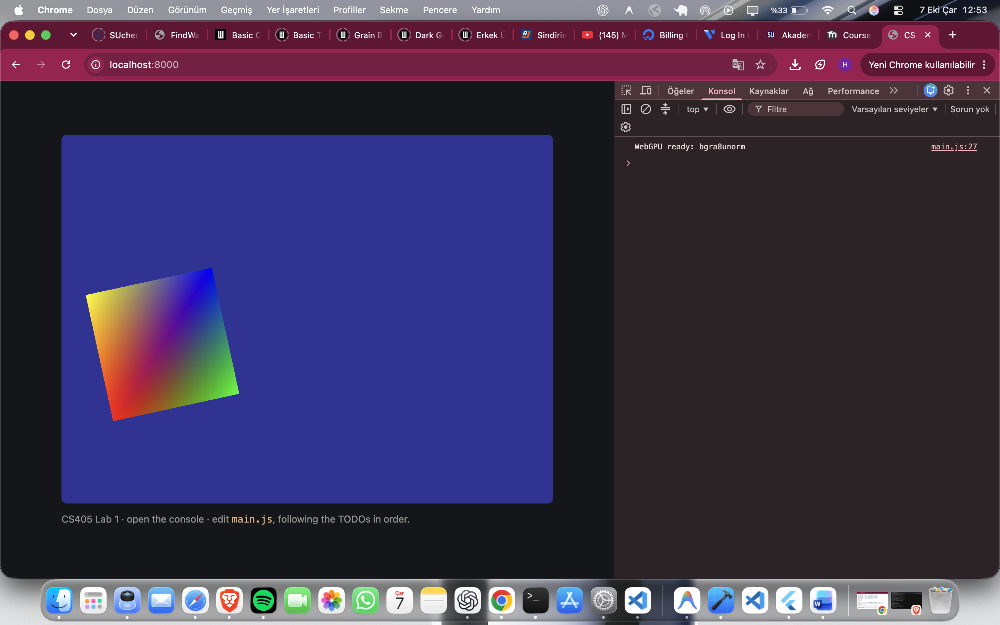
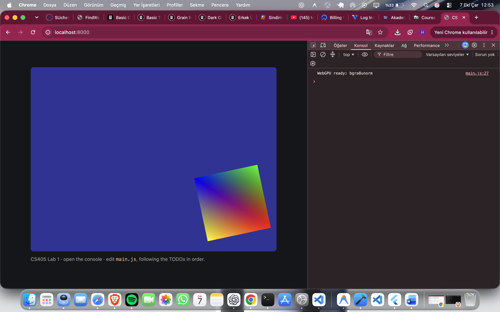

# CS405 Lab 1 — WebGPU

This project completes the CS405 WebGPU Lab 1 exercises.

## Features

- WebGPU device and canvas setup
- WGSL vertex and fragment shaders
- Interpolated vertex colours
- Time-based rotation using a uniform buffer
- A square built from two triangles (six vertices)
- Aspect-ratio correction
- Pointer tracking through uniform data

## Run locally

```bash
python3 -m http.server 8000
```

Then open [http://localhost:8000](http://localhost:8000) in a WebGPU-capable browser.

## Result




